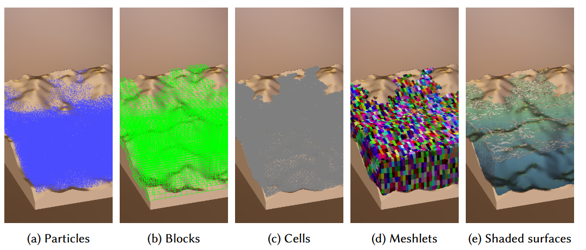
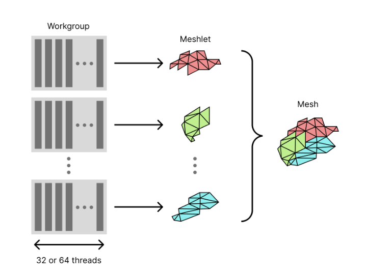
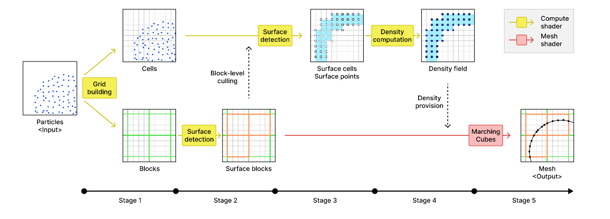
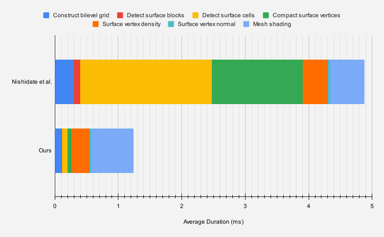
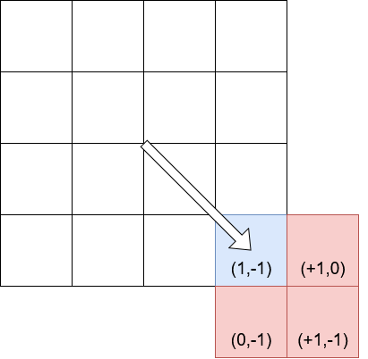
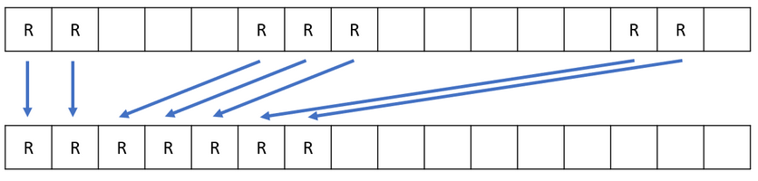
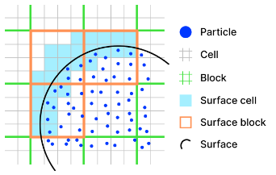
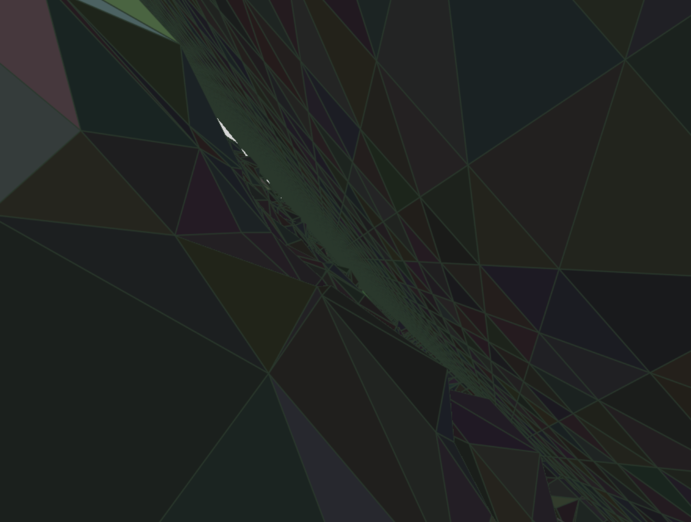
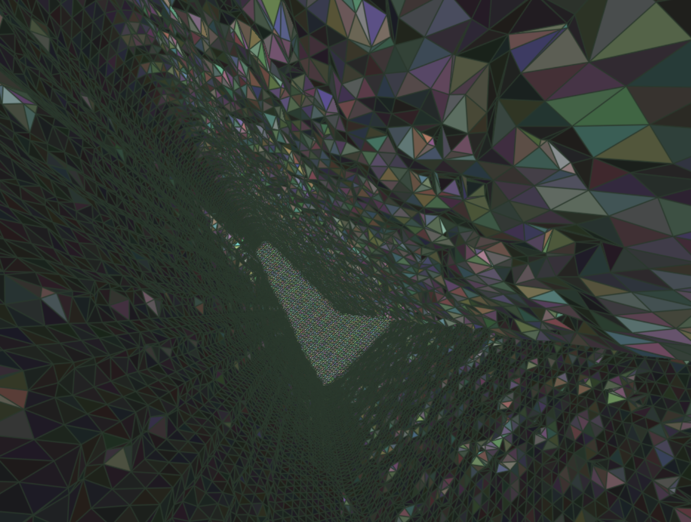
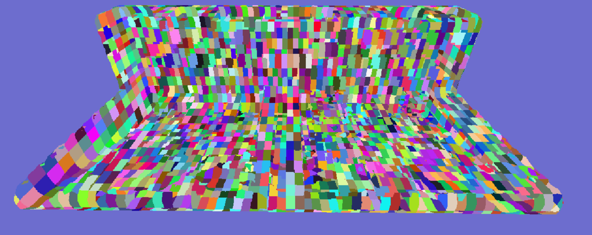

# Breakpoint

<table width="100%">
  <tr>
    <td>
      
    </td>
    <td>
      
    </td>
  </tr>
  <tr>
    <td colspan="2" align="center">
      <i>Fluid data rendered with mesh shading (left), meshlet / grid view (right) .</i>
      <br>
      <i>(data, models, and technique originally from Nishidate et al)</i>
    </td>
  </tr>
</table>

*Breakpoint* is a GPU-optimized fluid surface reconstruction implementation, based on the [mesh-shading algorithm authored by Nishidate et al.](https://dl.acm.org/doi/10.1145/3651285). I adapted their algorithm to run in a DirectX engine, and modified the implementation significantly to improve performance by almost a factor of 4x compared to [Nishidate's original implementation](https://github.com/yknishidate/mesh_shader_surface_reconstruction).

This work was originally a component of a project for CIS 5650 GPU Programming at the University of Pennsylvania. [Daniel Gerhardt](https://www.danieljgerhardt.com/), [Dineth Meegoda](https://dinethmeegoda.com/), and [Zixiao Wang](https://www.linkedin.com/in/zixiao-wang-826a5a255/) built the DirectX 12 engine and implemented a GPU-based PBMPM particle simulation (developed by EA), which served as the input data to this novel fluid surface shading technique. See that project in its entirety [here](https://github.com/dgerh/Breakpoint). Since then, I've continued to work on and improve the performance of the fluid surface reconstruction technique, in this fork.

## Contents

- [Fluid Mesh Shading](#fluid-mesh-shading)
- [Build instructions](#build-steps)
- [Citations and Attributions](#citations-attributions)
- [Bloopers and Debug views](#bloopers-and-debug-views)

## Fluid Mesh Shading

<p align="center">
  
  <br>
  <i>Fluid surface reconstruction - Nishidate et al.</i>
</p>

Nishidate's algorithm constructs the fluid surface's polygonal mesh via a GPU-accelerated marching cubes-based algorithm that utilizes mesh shaders to save on memory bandwidth. For the unfamiliar, mesh shading is a relatively new technology that replaces the primitive assembly, vertex, tesselation, and geometry stages of the graphics pipeline with a single, programmable, compute-like stage. The mesh-shading stage provides ultimate flexibility and opportunity to optimize and reduce memory usage, at the cost of increased implementation complexity. Notably, a mesh shader can only output a maximum of 256 vertices per "workgroup." This means that each workgroup of a mesh shader must coordinate, outputting individual "meshlets" to combine into the overall mesh:


<p align="center">
  
  <br>
  <i>Meshlets to meshes - Nishidate et al.</i>
</p>

To start, Nishidate's approach creates a bilevel uniform grid - a fine grid composed of "cells," and a coarse grid composed of "blocks." In constructing these grids, we evaluate all fluid particles and determine which cells and blocks they belong to. The coarse grid helps quickly identify surface blocks, and then the fine grid can be used to further hone in on surface cells. We then calculate the density at the vertices of these surface cells. This step is computationally expensive, and it's largely why Nishidate introduces the bilevel grid - to help limit density computation to the necessary regions. 

 The density field becomes the input to the mesh shader, where each thread performs marching cubes on each grid cell to create a fluid surface mesh. But the coarse-level grid is once again used here; by aligning each mesh shading workgroup to operate on half of a grid block, we can reduces vertex duplication at block-boundaries while staying under the 256-vertex limit per mesh shading workgroup. 
 
 The approach can be visualized below:

<p align="center">
  
  <br>
  <i>Technique overview - Nishidate et al.</i>
</p>

The above stages manifest as 6 compute passes and a mesh shading pass, which can be described as:
1. Building the grids (putting particles into cells and blocks)
2. Detecting which blocks are "surface" blocks
3. Detecting which cells are "surface" cells
4. Compacting vertices of all surface cells into a non-sparse array
5. Computing the density of particles at each surface vertex
6. Computing the normals at each surface vertex
7. (Mesh shading) Using marching cubes to triangulate the particle density field, then fragment shading (which uses the normals derived in step 6).

In the course of implementing these passes, I found many opportunities for significant performance improvements based on the core concepts taught in CIS 5650. To illustrate this, compare the average compute time (in milliseconds, averaged over 1,000 frames) for each step listed above between my implementation and the original:

| Algorithm step              | Nishidate et al. | Mine  |
|-----------------------------|------------------|-------|
| Construct bilevel grid      | 0.297            | 0.107 |
| Detect surface blocks       | 0.099            | 0.006 |
| Detect surface cells        | 2.074            | 0.083 |
| Compact surface vertices    | 1.438            | 0.061 |
| Surface vertex density      | 0.391            | 0.285 |
| Surface vertex normal       | 0.038            | 0.028 |
| Mesh shading                | 0.543            | 0.671 |
| **Total (ms):**                  | **4.88**         | **1.241** |

*Nearly a 4x improvement in performance!*

<p align="center">
  
  <br>
  <i>Performance comparison</i>
  <br>
  <i>(Tested on: Windows 10 22H2, Intel(R) Core(TM) i7-10750H CPU @ 2.60GHz, NVIDIA GeForce RTX 2060)</i>
</p>


Let's discuss each step in the technique and analyze the optimizations that account for the differences in computation time:

### Construct the bilevel grid

In this step, particles are placed into blocks (the coarse structure) and cells (the fine structure). Threads are launched for each particle, and the particle's position determines its host cell. The first particle in each cell increments the containing block's count of non-empty cells, *as well as neighboring blocks' count*. In the original paper, this thread iterates over 27 neighboring blocks and uses highly divergent logic to narrow down to a maximum of 8 neighbors close enough to be considered.

In my implementation, I use clever indexing math to calculate the iteration bounds for the exact 8 neighboring blocks a-priori, avoiding much of the divergent logic.

<p align="center">
  
  <br>
  <i>The light blue cell is on the positive X edge and negative Y edge of the block, thus (1, -1). The offset to each closest neighbor cell (red) can be derived as a combination of these coordinates (1, -1), and 0. The same approach extends to 8 neighbors in 3D. </i>
</p>

We can take a vector from the center of a block to the cell represented by a given thread, and then remap that distance such that cells on the border of a block evaluate to ±1, and anything cell inside is 0. Not only does this tell us whether or not a cell is on a block boundary, it also gives us the directions we need to search for the 8 neighboring blocks 

```GLSL

    // (±1 or 0, ±1 or 0, ±1 or 0)
    // 1 indicates cell is on a positive edge of a block, -1 indicates cell is on a negative edge, 0 indicates cell is not on an edge
    // This should work for both even and odd CELLS_PER_BLOCK_EDGE
    float halfCellsPerBlockEdgeMinusOne = ((CELLS_PER_BLOCK_EDGE - 1) / 2.0);
    int3 edge = int3(trunc((localCellIndices - halfCellsPerBlockEdgeMinusOne) / halfCellsPerBlockEdgeMinusOne));

    ...

    int3 globalNeighborBlockIndex3d = clamp(blockIndices + edge, int3(0, 0, 0), gridBlockDimensions - 1);
    int3 minSearchBounds = min(blockIndices, globalNeighborBlockIndex3d);
    int3 maxSearchBounds = max(blockIndices, globalNeighborBlockIndex3d);
```

As you can see in the above results table, this single difference nearly tripled the performance of this step when compared to the original. A great example of the power of thread convergence!

### Detect surface blocks

In this step, we take the array of blocks, detect which are surface blocks (`nonEmptyCellCount > 0`), and put the indices of those surface blocks into a new, compact array. Each thread acts as a single block. The paper accomplishes this by having each surface-block thread atomically add against an index, and using that unique index to write into the output surface block indices array.

Both the issue with and solution to this approach were immediately clear to me: 

The issue - heavy use of atomics creates high contention and can lead to serial access. Very slow. 

The solution - stream compaction! Stream compaction is widely used to do precisely this task: filter on an array and compress the desired entries into an output array.

<p align="center">
  
  <br>
  <i>Stream compaction illustrated</i>
</p>

With [parallel prefix scan](https://developer.nvidia.com/gpugems/gpugems3/part-vi-gpu-computing/chapter-39-parallel-prefix-sum-scan-cuda), 0 atomic operations are necessary. However, given DirectX's lack of a library like Thrust, implementing a prefix scan in the timeframe of this project was out of scope. Instead, I opted for a simpler, yet highly effective, wave-intrinsic approach, [based on this article](https://interplayoflight.wordpress.com/2022/12/25/stream-compaction-using-wave-intrinsics/). The gist is, each wave coordinates via intrinsics to get unique write-indices into the output array, needing only 1 atomic operation per-wave to sync with the other waves. With 32 threads per wave, this is a 32x reduction in atomic usage! The effect may be superlinear, however, since there's much less chance of resource contention with such a reduction in atomic usage.

As such, it's no surprise that my implementation of this stage was over 16x faster than the original!

### Detect Surface Cells

In this next step, we move from the coarse-grid to the fine. Each thread in this pass, representing a single cell in a surface block, checks its neighboring 27 cells to determine its own status as a potential surface cell. Surface cells are those which are neither completely surrounded by filled cells, nor by empty cells (itself included).

<p align="center">
  
  <br>
  <i>Surface cells and blocks. Note how some cells are "surface" cells even if they contain no particles. Image from Nishidate et al.</i>
</p>


The major optimization opportunity of this step is in the original paper's heavy use of global memory. Since each cell needs to reference all of its neighbors, that means each thread does 27 global memory accesses. Ouch! I noticed, however, that many of these accesses are redundant. Consider two adjacent cells; each has 27 neighbors, but 9 of those neighbors are shared! The optimization opportunity improves exponentially when you consider that we're analyzing *blocks* of cells, with nearly complete neighbor overlap.

The solution, then, is to pull all cell data for a block into groupshared memory. This way, for a given block of 64 cells (4 x 4 x 4), instead of doing 27 * 64 = 1728 global memory reads, we only need to do 125 reads (5 x 5 x 5). Each cell still looks up neighboring information, but from shared memory instead of global memory. The indexing is somewhat complex to make sure that 64 threads can efficiently pull data for 125 cells (the border cells have to do extra work), but we can actually repurpose the indexing trick from the bilevel grid construction to get the right iteration bounds!

And, once again, looking at the performance results above, we see a **massive** 25x increase in performance.

### Compact Surface Vertices

This is exactly the same idea as the wave intrinsic optimization done in detecting surface blocks, but with the surface vertices! Because there are so many more vertices than surface blocks, the contention with atomic usage is exacerbated, and the performance gains after alleviating atomic usage are even greater: 20x with my approach!

### The rest

Aside from these major optimizations, there were also several smaller ones that I'll mention briefly:
- The original paper uses one-dimensional workgroup dispatches. This results in a few places where expensive modular arithmetic must be used to convert from a 1D index to a 3D index. By using a 3D workgroup, which better aligns with the underlying model, we can avoid some (but not all) of that modular arithmetic.
- Rather than projecting each fluid mesh fragment to screen space in the fragment shader, I do that in the mesh shading step per-vertex and allow it to be interpolated.
- I also avoided divergent control flow logic in deeply nested loops by precalculating iteration bounds (and pre-clamping to grid boundaries).

Finally, *why is my mesh shading step slower than Nishidate's?* This is almost entirely because I'm outputting more data per vertex. Due to DirectX constraints, it's necessary for us to output both a world position and an NDC position of each vertex, even though we really only need the former. In the implementation by Nishidate et al., they output only one position. A quick test on my pipeline shows that this extra position data accounts for the slow down.

## Build Steps

- Clone the repo
- Download the fluid alembic file (FluidBeach.abc) from [this drive link](https://drive.google.com/file/d/1GKLsSbi_SuWseMiVTzaCh9x3Vs0mkZlY/view?usp=sharing), and place it in the app folder
- Open Breakpoint.sln in Visual Studio and press the green play button (or trigger build from the menu option).

It can also be run in VSCode, but must be built the first time from Visual Studio. To run in VSCode:

From the command pallete (Ctrl + Shift + P), run Debug: Select and Start Debugging > Release to build and run the release build of the project.

## Citations, Attributions

Thank you to Yuki Nishidate for corresponding with me about his work. A big thank you as well to the folks on the DirectX discord server, who helped me debug a number of issues in engine setup, mesh shading, and PIX.

```
@article{10.1145/3651285,
    author = {Nishidate, Yuki and Fujishiro, Issei},
    title = {Efficient Particle-Based Fluid Surface Reconstruction Using Mesh Shaders and Bidirectional Two-Level Grids},
    year = {2024},
    issue_date = {May 2024},
    publisher = {Association for Computing Machinery},
    address = {New York, NY, USA},
    volume = {7},
    number = {1},
    url = {https://doi.org/10.1145/3651285},
    doi = {10.1145/3651285},
    journal = {Proc. ACM Comput. Graph. Interact. Tech.},
    month = {may},
    articleno = {1},
    numpages = {14},
}
```

## Bloopers and Debug views

<p align="center">
  <i>Inside the mesh-shaded fluid in PIX debug view</i>
  </br>
  
</p>


<p align="center">
  
</p>

<p align="center">
  <i>Meshlet view, but I forgot to wire up a depth buffer!</i>
  </br>
  
</p>
